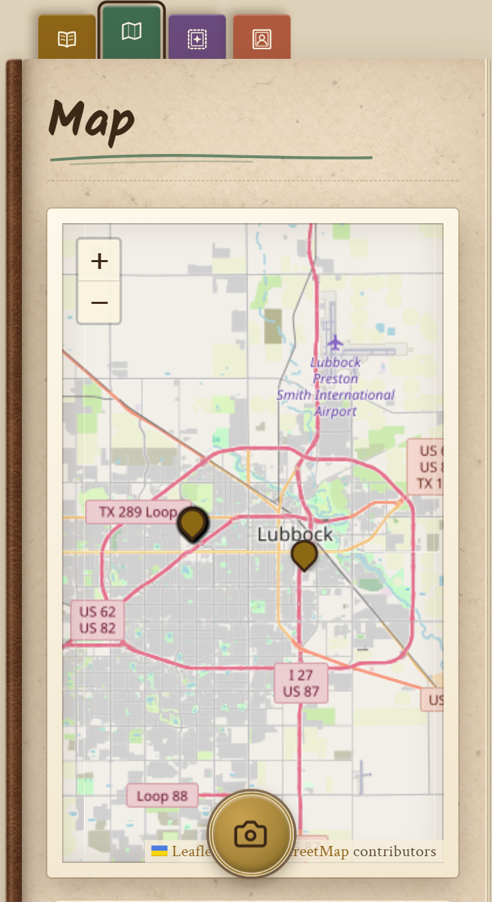
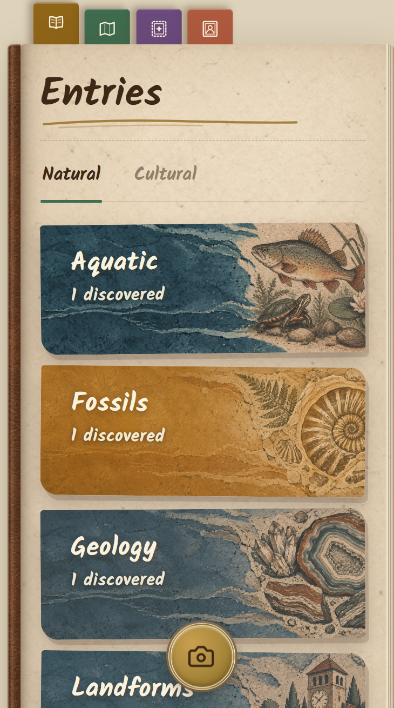

<div align="center">


# Wayfinder

**An explorer's journal at your fingertips.**

[](https://opensource.org/licenses/MIT)

[](https://flask.palletsprojects.com/)
[](https://sqlite.org/)
[](https://react.dev/)
[](https://railway.app/)

</div>

Wayfinder is an image-recognition-powered web app that lets users take photos of objects with heritage significance around them, including cultural items such as art, artifacts, and historical sites, as well as natural items such as fossils, geology, and landforms.
### Core Features
1. Take pictures, identify items, and add them to your collection.
2. 16 subcategories of items to discover
3. Collect all 9 stamps by completing challenging achievements
4. Add friends, compare stamps, and track their discovery process


## Screenshots
<!-- add screenshots here, do like 2 or 3 -->

<p align="center">
  
  &nbsp;&nbsp;&nbsp;
  
</p>

## Built with
* **Database**: SQLite
* **Backend**: Flask
* **Authentication**: Auth0
* **Image Recognition**: Gemini API
* **Frontend**: React 19 + Vite
* **Deployment**: Railway


## Setup
Wayfinder runs as two processes: a Flask API and a Vite dev server for the React frontend.

**Before you start**, you will need Python 3.13, Node 20.19 or newer (or 22.12 and above), a Gemini API key, and an Auth0 tenant. Auth0 is not optional for local development: the frontend refuses to start without it and shows a configuration notice instead.

### 1. Clone the repository
```bash
git clone https://github.com/AustinN-Tech/Wayfinder.git
cd Wayfinder
```

### 2. Create and activate a virtual environment
```bash
python3 -m venv venv
source venv/bin/activate
```
On Windows, use `venv\Scripts\activate` instead.

### 3. Install the backend requirements
```bash
pip install -r requirements.txt
```

### 4. Configure the backend
```bash
cp .env.example .env
```
Fill in the new `.env`:

| Variable | Required | Notes |
| --- | --- | --- |
| `GEMINI_API_KEY` | Yes | From Google AI Studio. Identification returns an error without it. |
| `AUTH0_DOMAIN` | Yes | Your Auth0 tenant domain. |
| `AUTH0_AUDIENCE` | Yes | The identifier of your Auth0 API. |
| `FRONTEND_ORIGIN` | No | Restricts CORS to one origin. All origins are allowed if unset. |

Leaving both Auth0 values blank makes the API run unauthenticated as a single fixed user, which is useful for testing endpoints directly but will not work with the frontend.

### 5. Install the frontend dependencies
```bash
cd server
npm install
```

### 6. Configure the frontend
```bash
cp .env.example .env
```
Fill in `VITE_AUTH0_DOMAIN`, `VITE_AUTH0_CLIENT_ID` and `VITE_AUTH0_AUDIENCE` from your Auth0 single-page application. `VITE_API_URL` defaults to `http://localhost:5000` and only needs setting if the API runs elsewhere.

`VITE_AUTH0_AUDIENCE` must byte-match `AUTH0_AUDIENCE` in the backend `.env`. If the two differ, Auth0 issues a token the backend cannot verify and every protected request returns 401.

In the Auth0 application settings, add `http://localhost:5173` to Allowed Callback URLs, Allowed Logout URLs, and Allowed Web Origins.

### 7. Start the backend
From the repository root, with the virtual environment active:
```bash
python src/app.py
```
This serves the API on port 5000 and creates `image_storage/` on first run, which holds both the SQLite database and the uploaded photos.

### 8. Start the frontend
In a second terminal, from `server/`:
```bash
npm run dev
```
### 9. Open the app
Vite prints a local URL, `http://localhost:5173` by default. Open it and sign in to create your journal.

## Roadmap
* More achievements
  * Add more achievements such as Deep Diver - Discover 10 Maritime Items, Seasoned Explorer - Discover 10 Landmarks, etc.
* View friends’ collections.
  * Users are able to view the entirety of the collections of other users who are on their friends list.
* Weekly challenge
  * Global challenge available for all users, changes weekly.
* Friendly challenge
  * Users are able to make a friendly challenge (ie: ‘Obtain 5 new fossils by the end of the week’) to other users on their friends list.
